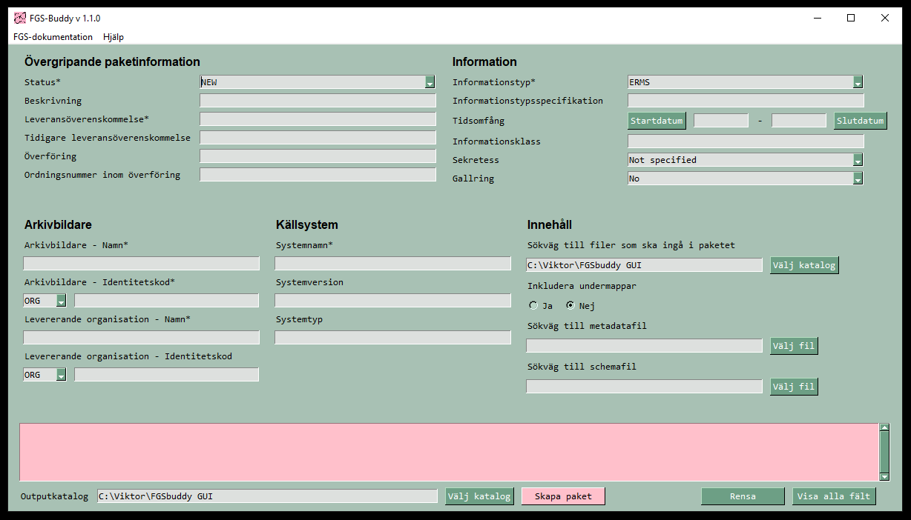
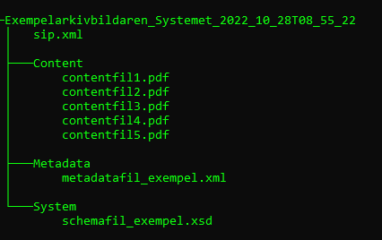

# FGS Buddy :sunglasses:

 

En grym liten FGS-paketerare för att skapa SIP-paket till e-arkiv.

---

## Features :star:
* Följer Riksarkivets standard FGS-paketstruktur version 1.2.
* Kan hantera innehåll (content) som är lagrat i undermappar i flera nivåer.  
* Genererar checksummor, identifierar MIME-typer, filstorlekar och tidpunkt för skapande för de filer som ingår i SIP-paketet.
* Ger filerna korrekta filnamn enligt FGS-standarden samtidigt som originalnamnet bevaras som metadata.   
* Ger möjlighet att lägga till schemafil och metadatafil i paketet. 
* Innnehåller tooltips med besrivande hjälptexter hämtade från standarden för alla fält + hänvisning till var fältet hamnar i sip.xml.
* Sparar paketet som en zip-fil som namnges "Arkivbildarnamn_Systemnamn_ÅÅÅÅ_MM_DDTHH_MM_SS.zip". 

---

## Struktur på SIP-paketet :package:

Exempel på strukturen i ett enkelt SIP-paket skapat av FGS-Buddy:  

---

## Kom igång :rocket:

1. [Ladda ner den senaste releasen av FGS-Buddy.](https://github.com/Viktor-Lundberg/FGSBuddy/releases)
1. Packa upp zip-filen på din dator där du vill lagra applikationen.
1. Starta FGS-Buddy med "FGSbuddyGUI.exe".
1. Fyll i relevant metadata för ditt SIP-paket.
1. Välj vilken katalog som paketinnehållet (filerna) ska hämtas ifrån och om även underkataloger ska ingå i paketet.
1. Välj eventuell metadatafil och schemafil.
1. Välj output-katalog där Buddyn ska spara SIP-paketet.
1. Klicka på "Skapa paket" - Buddyn ger feedback ifall något av de obligatoriska värdena saknas, annars genereras SIP-paketet.
1. Hämta upp ditt färdiga SIP-paket i vald katalog.   

---

## Kända problem :warning:

* Applikationen kan ta lång tid att starta om den körs från en nätverksdisk. Rekommendationen är att alltid installera FGS-buddy på en lokal disk (exempelvis c:).
* Tooltips på flera rader laddas inte alltid. - workaround flytta muspekaren från fältet och försök igen.

---

## Credits :trophy:

* Martin Olsson - Har bidragit med funktionstester, idéer kring funktionalitet och feedback kring implementering av FGS-paketstruktur.
* Dan Lundh - Agerat bollplank kring FGS-buddy.
* Glasögon till ikonen hämtade från - http://clipart-library.com/clipart/1943208.htm  

---
 
 This work is licensed under a <a rel="license" href="http://creativecommons.org/licenses/by-nc/4.0/">Creative Commons Attribution-NonCommercial 4.0 International License</a>.

